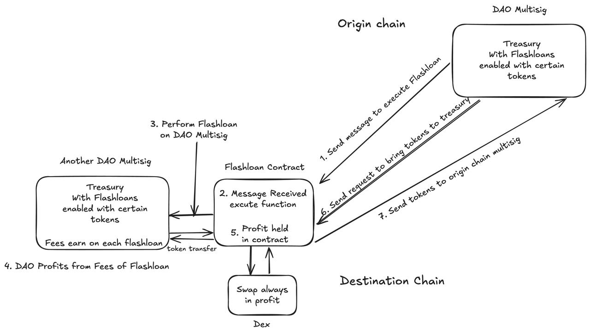

# FlashFi

FlashFi is a decentralized flash loan protocol designed specifically for DAOs, enabling efficient treasury management through multi-signature controlled flash loans.

## Overview

FlashFi revolutionizes DAO treasury management by allowing DAOs to utilize their idle treasury funds through a secure multi-signature flash loan system. Unlike traditional flash loan protocols where funds remain untouched, FlashFi enables DAOs to generate yield while maintaining security through multi-signature governance.

## Architecture

The FlashFi architecture consists of several key components working together to provide secure, multi-signature controlled flash loans:

1. **Smart Contract Layer**
   - Core Flash Loan Logic
   - Multi-signature Validation
   - Treasury Management Contracts
   - Security Controls

2. **Governance Layer**
   - DAO Multi-sig Controls
   - Proposal Management
   - Voting Mechanisms
   - Access Control

3. **Integration Layer**
   - External Protocol Interfaces
   - Cross-chain Bridges
   - Oracle Connections
   - API Endpoints

This architecture ensures secure treasury management while maintaining the flexibility needed for flash loan operations, all protected by multi-signature controls.

## Problem It Solves

### Treasury Management
- Enabling quick liquidity for time-sensitive opportunities while maintaining security through multi-sig approval
- Allowing temporary capital access without permanently moving funds from safe storage

### Risk Management
- The multi-sig requirement ensures multiple parties must approve any flash loan usage
- Prevents single points of failure in treasury operations

### Governance Efficiency
- Enables faster execution of approved proposals that require temporary capital
- Maintains decentralized control while improving operational speed

## Key Features

- **Multi-Signature Security**: All flash loan operations require multiple approvals
- **Permissionless Access**: Anyone can use the protocol while maintaining security
- **Same-Block Transactions**: Borrow and repay within the same block
- **Treasury Utilization**: Generate yield on previously idle DAO treasury funds
- **Low Risk Operations**: Focus on secure, profitable treasury management

## Use Cases

- Arbitrage opportunities
- Position management
- Cross-chain operations
- Yield generation on idle funds

## Advantages Over Traditional Flash Loans

Unlike existing solutions (e.g., Aave), FlashFi:
- Activates idle treasury funds
- Enables yield generation on previously dormant capital
- Maintains DAO security through multi-sig controls
- Provides permissionless access with built-in governance

## Getting Started

Please refer to individual package documentation for specific setup instructions:

- [FlashFi-Contracts](./FlashFi-Contracts/README.md) - Smart contract implementation
- [FlashFi-Interface](./FlashFi-Interface/README.md) - User interface

| Component | Description |
|-----------|-------------|
| FlashFi-Contracts | Core smart contracts implementing flash loan and multi-sig logic |
| FlashFi-Interface | Web interface for interacting with the FlashFi protocol |

## License

This project is licensed under the MIT License - see the [LICENSE](LICENSE) file for details.

